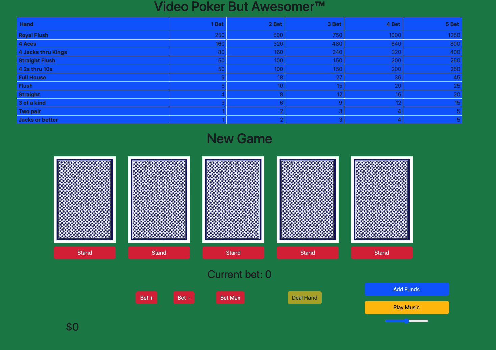
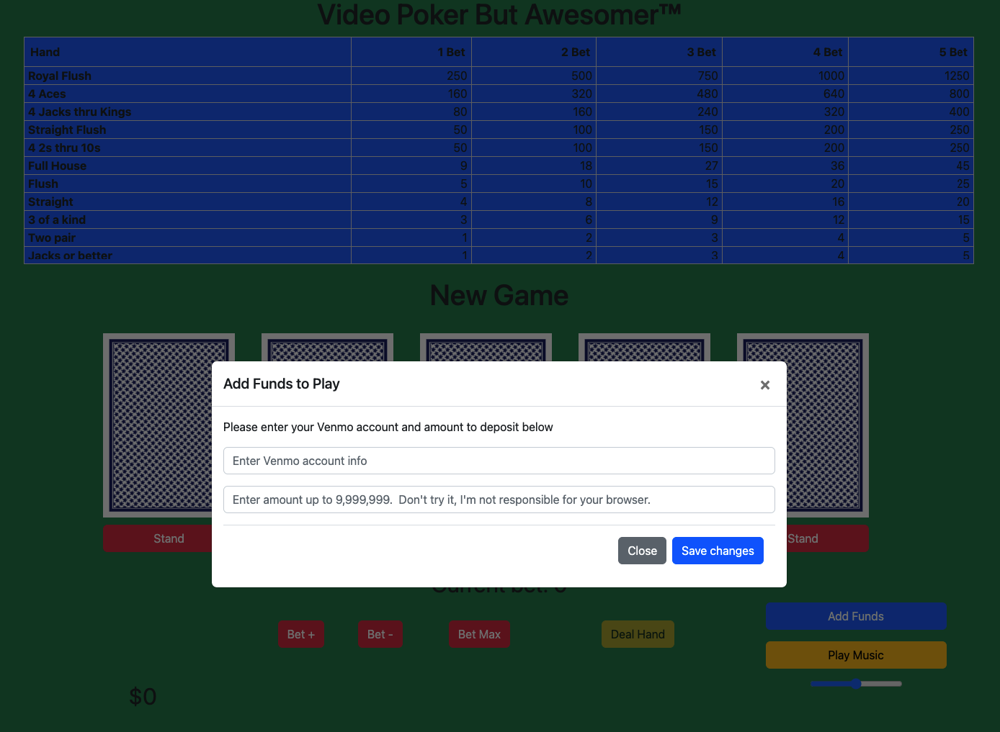
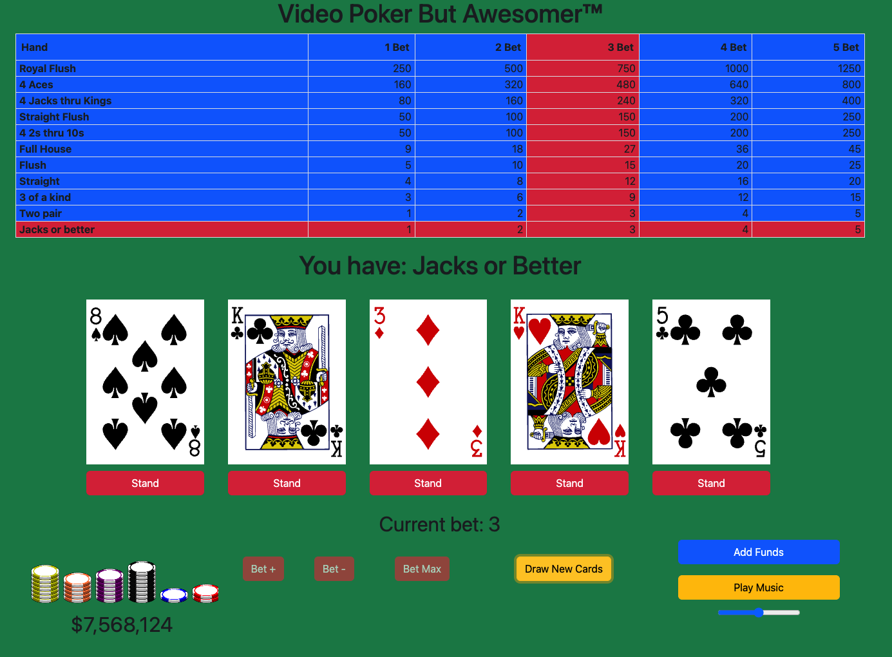

# Video Poker But Awesomer™

Run of the mill Las Vegas video poker game, but less obnoxious.  

Now with mouse support!

## Screenshots

Splash screen

 

Add funds interface

 

Gameplay

 

## Technologies Used
- JavaScript
- JQuery
- Bootstrap
- HTML
- CSS

## Getting Started

1. Open the game in your browser - <a href="https://jsquarem.github.io/SEI-P1-Video-Poker/">https://jsquarem.github.io/SEI-P1-Video-Poker/</a> (hosted by GitHub Pages).
2. Click on add funds to desposit funds up to $9,999,9999.
3. Set your bet amount.
4. Play!
5. Optionally click the "Play Music" button to listen to some totally liscensed music.

## Next Steps

- Add keyboard support
- Add some high-quality background images.
- Connect play music to a radio api.
- Iron out some visual inconsistencies.
- Connect to Venmo API so I can get paid.
- Rewrite the render logic to make it more efficient (it is drawing too much too often).
